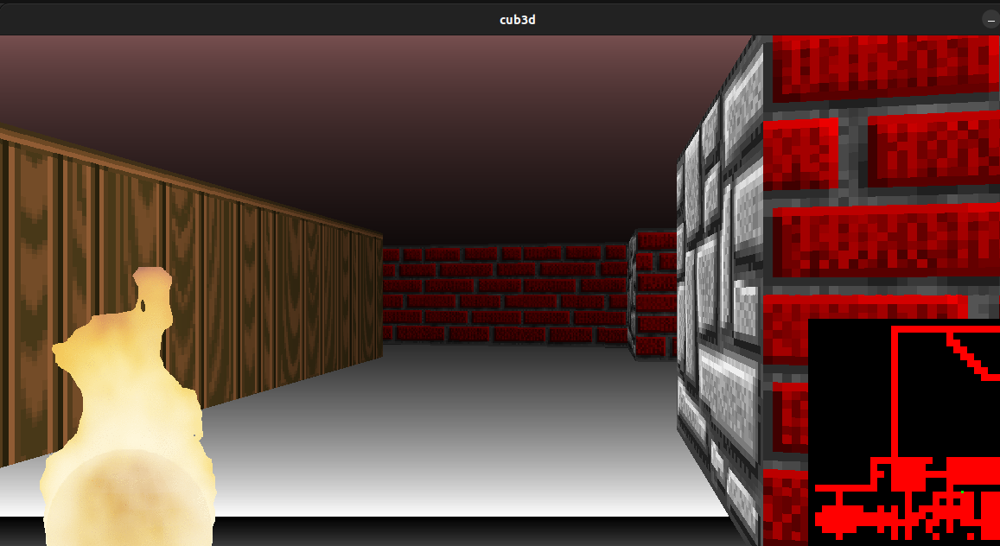

# so_long

### Description
A graphic project on MiniLibX using raycasting (like old games from 90s) for macOS and Linux (separate branch).

### How to launch (Linux)
    
1) Install required libraries:

    sudo apt-get update && sudo apt-get install xorg libxext-dev zlib1g-dev
    
2) Build executable file with command:

    `make all` or `make bonus` (bonus is much more interesting).

3) Start the game with predefined map as argument.

   `./so_long  map.ber`

4) Enjoy!
